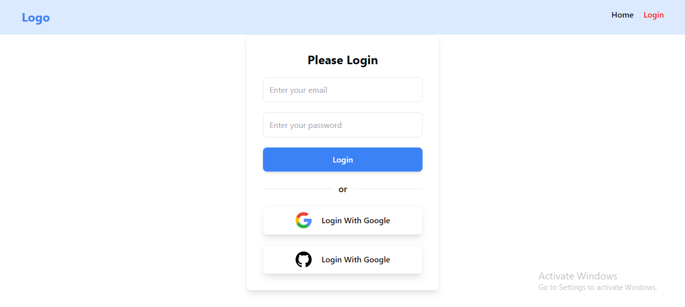

# Simple React Firebase Authentication

- This is a simple react firebase authentication project. 
- This project has built using react, vite, firebase, react-router etc.

## Important Notes

- if I set `null` as the initial value of user (like: `const [user, setUser] = useState(null)`), I **can show** user-information using `{user && 
{user.email}
}`

- If I set empty object: `{}` as the initial value of user (like: `const [user, setUser] = useState({})`), I **can not show** user-information using `{user && 
{user.email}
}` because: here, `user means {}` which value is `true`. So, I have to use `user.email && ........`

- using `{}` is better then `null` when I want to access `user.uid` means `{}.uid ==> undefined`, It don't show error. But using `null` shows error when I want to access `user.uid` means `null.uid ==> error`

- In this project using `{}` is not better. Because when user logged out, then `setUser(currentUser) ==> null` user will null. So `{user.uid && 
........
}` shows error. As a result, **initial value of user should be `null`** (like: `const [user, setUser] = useState(null)`) 

### login page

### After login with google

